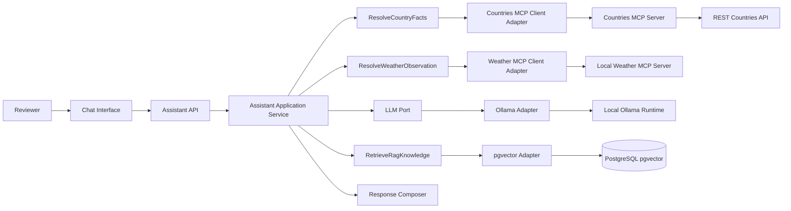
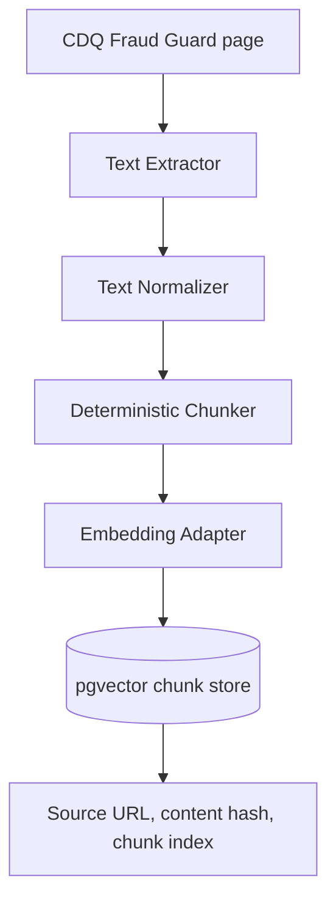
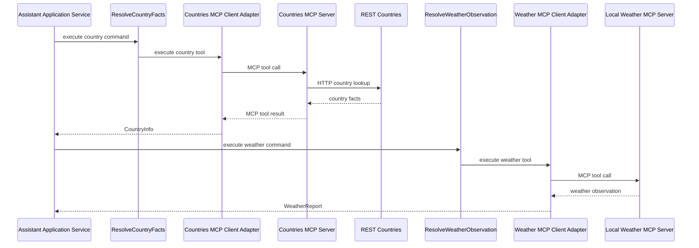
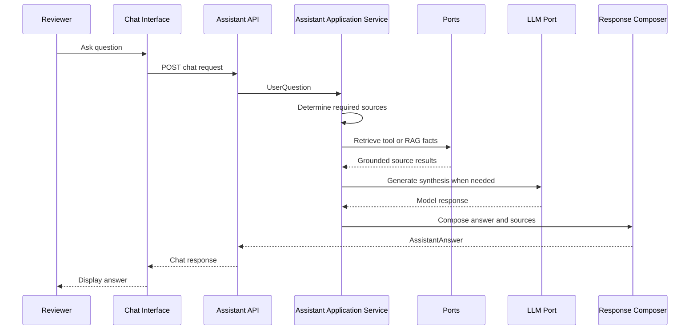
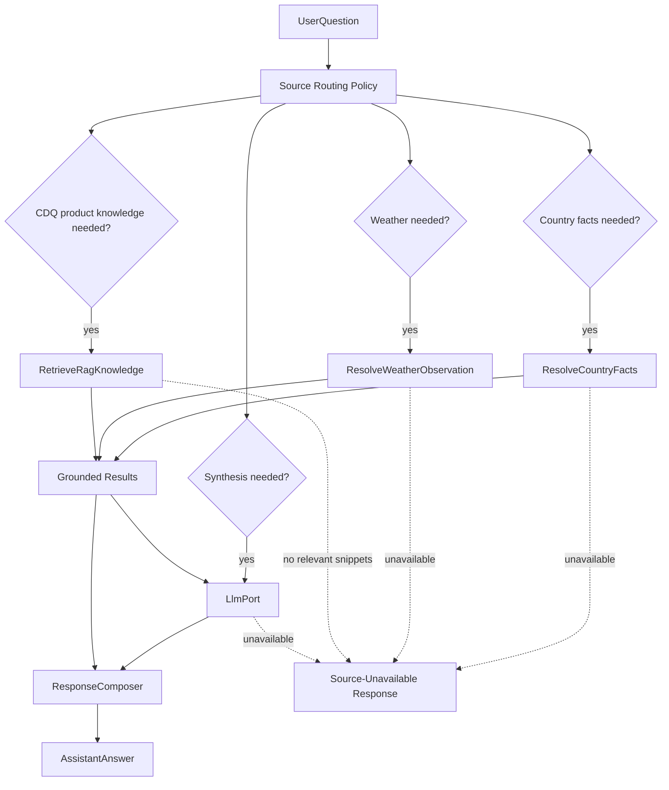
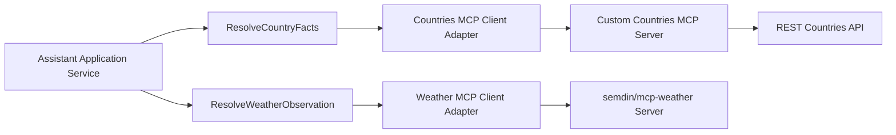

# Architecture

## 1. System Overview

The Local AI Assistant is a local-first Java application for a recruitment-task reviewer. It exposes a chat interface and answers questions by routing each request to the right knowledge source:

- country facts from REST Countries through a custom countries MCP server;
- current weather observations from the local `semdin/mcp-weather` MCP server;
- CDQ Fraud Guard product knowledge from RAG knowledge stored in pgvector;
- language synthesis from local Ollama model `qwen3:4b`.

The assistant must not present model memory as verified country facts, weather observations, or RAG knowledge. When a required source is unavailable, it returns a source-unavailable response that names the failed source.

### High-Level System Architecture



## 2. Hexagonal Architecture Explanation

The application core owns behavior and ports. Inbound adapters translate external requests into application use cases. Outbound adapters implement application-owned ports for model calls, RAG retrieval, MCP tools, persistence, and external HTTP APIs.

This keeps the assistant testable:

- controllers do not contain orchestration decisions;
- application services coordinate the request flow;
- domain concepts stay independent from Spring where reasonable;
- infrastructure adapters can be replaced by controlled test adapters;
- source-unavailable behavior is verified without relying on uncontrolled external services.

DDD is used pragmatically. The domain is small, so the design should use explicit value objects and use-case services, not ceremonial aggregates.

## 3. Module Boundaries

```text
assistant-app/
chat-ui/
countries-mcp-server/
e2e-tests/
shared-kernel/   (conditional: created only when a concrete cross-module type exists)
```

### `assistant-app`

Owns the Assistant API (SSE over HTTP), application orchestration, RAG ingestion and retrieval orchestration, and outbound adapters for Ollama, pgvector, countries MCP, and weather MCP. It does not serve the Chat Interface HTML; that lives in `chat-ui/`.

### `chat-ui`

Owns the browser-facing Chat Interface as a separate Astro frontend. It calls the Assistant API over HTTP. It is not a Java module and does not import `assistant-app` internals.

It may depend on `shared-kernel` if that conditional module exists. It must not depend on `countries-mcp-server` internals.

### `countries-mcp-server`

Owns the custom MCP server that exposes country tools backed by REST Countries. It translates MCP tool calls into REST Countries HTTP requests and returns structured tool results.

If the conditional `shared-kernel` module exists, it may depend on it only for shared value shapes that do not couple it to assistant orchestration.

### `shared-kernel`

Conditional module. It is created only when a concrete type must actually be shared between `assistant-app` and `countries-mcp-server`; until then it does not exist. Because the two modules communicate over MCP (a process boundary) rather than shared Java types, this module may never be needed. If it is created, it owns only small domain concepts that are genuinely stable across modules and stays minimal. A concept used by one module only stays in that module.

### `e2e-tests`

Owns black-box tests and demo verification scripts that run against local services. It should verify externally visible behavior rather than application internals.

## 4. Suggested Package Structure

Package names should describe business capabilities first and technical adapters second.

```text
assistant-app/src/main/java/.../assistant/
  question/
    UserQuestion.java
    AssistantAnswer.java
    AnswerSource.java
    ConversationTurn.java
  orchestration/
    AnswerQuestionUseCase.java
    AssistantApplicationService.java
    ResponseComposer.java
  rag/
    api/
      RagIngestionCli.java
    domain/
      KnowledgeSnippet.java
      RagIngestion.java
      RagRetrievalPolicy.java
      port/inbound/
        IngestRag.java
        RetrieveRagKnowledge.java
      port/outbound/
        ProductPageSource.java
        KnowledgeEmbedding.java
        KnowledgeChunkStore.java
    infrastructure/
      CdqProductPageSource.java
      RagRetrieval.java
      PgvectorKnowledgeChunkStore.java
      OllamaEmbeddingAdapter.java
      config/
        RagUseCaseConfiguration.java
        PgvectorInfrastructureConfiguration.java
        OllamaEmbeddingConfiguration.java
  countryfacts/
    domain/
      CountryInfo.java
      port/inbound/
        ResolveCountryFacts.java
    infrastructure/
      CountriesMcpClientAdapter.java
      CountriesMcpResponseMapper.java
  weather/
    domain/
      Location.java
      WeatherReport.java
      WeatherTimestamp.java
      port/inbound/
        ResolveWeatherObservation.java
    infrastructure/
      WeatherMcpClientAdapter.java
      WeatherMcpResponseMapper.java
  shared/
    SourceUnavailability.java
    ToolExecutionResult.java
    mcp/
      McpToolInvoker.java
      StdioMcpToolInvoker.java
  synthesis/
    domain/
      LlmResult.java
      PromptContext.java
      TokenSink.java
      port/outbound/
        LlmPort.java
    infrastructure/
      OllamaLlmAdapter.java
      config/
        OllamaSynthesisConfiguration.java
  adapters/inbound/http/
    ChatController.java
    ChatRequest.java
    ChatResponse.java
  config/
    AssistantProperties.java
```

```text
countries-mcp-server/src/main/java/.../countries/
  core/
    CountriesMcpServerFactory.java
  tools/
    CountryLookupTool.java
    CountryToolResult.java
  application/
    LookupCountryUseCase.java
    CountriesApplicationService.java
  ports/
    RestCountriesPort.java
  adapters/inbound/mcp/
    CountriesMcpServerAdapter.java
  adapters/outbound/restcountries/
    RestCountriesHttpAdapter.java
  schemas/
    CountryToolSchemas.java
  services/
    RestCountriesLookupService.java
  support/errors/
    CountryToolErrors.java
  config/
    CountriesMcpProperties.java
```

## 5. Domain Boundaries

Recommended domain concepts:

- `UserQuestion`: the normalized user input for one request.
- `AssistantAnswer`: final response text plus sources and source status.
- `AnswerSource`: one source used or attempted for an answer.
- `KnowledgeSnippet`: retrieved RAG knowledge with source URL and chunk metadata.
- `CountryInfo`: country facts returned through the countries capability.
- `WeatherReport`: current weather with location and a `WeatherTimestamp` that is either an observed time from the weather source or, when the source provides none, the adapter's retrieval time. A retrieval time is never relabeled as an observed time.
- `ToolExecutionResult`: success or source-unavailable result from an MCP tool.
- `ConversationTurn`: request-local input/output data only, not persistent memory.

Domain objects should validate their own invariants, such as non-empty question text or weather reports requiring location and timestamp. They should not import Spring, HTTP clients, database APIs, or MCP SDK types.

## 6. Ports and Adapters

### Inbound Adapters

- Chat Interface (`chat-ui/`): Astro browser client; calls the Assistant API.
- Assistant API (`assistant-app` inbound HTTP): `POST /api/chat` streams `text/event-stream` (Source-Usage Trace + Streamed Answer; terminal `final` event is authoritative). Used by the Chat Interface and E2E tests. See ADR `0009` and `docs/spec/14-assistant-api-contract.md`.
- RAG ingestion command or endpoint: local setup path for extracting and loading CDQ Fraud Guard content.

### Application Ports

- `LlmPort`: generate model output from grounded prompt context. It lives under `synthesis.domain.port.outbound`.
- `IngestRag`: ingest CDQ Fraud Guard product content into RAG knowledge.
- `RetrieveRagKnowledge`: retrieve relevant `KnowledgeSnippet` values.
- `ResolveCountryFacts`: resolve country facts through the countries MCP tool.
- `ResolveWeatherObservation`: resolve current weather observations through the weather MCP tool.

`LlmPort` is the assistant's AI gateway. It centralizes model communication, prompt settings, timeout behavior, and provider-specific response mapping. The application service should depend on this port instead of calling Spring AI or Ollama directly.

### Outbound Adapters

- Ollama synthesis adapter for local model completion (`qwen3:4b`) in `synthesis.infrastructure`, through the Spring AI Ollama chat client.
- Ollama embedding adapter for RAG embeddings (`nomic-embed-text`, dimension `768`; ADR `0007`) in `rag.infrastructure`, through the Spring AI Ollama embedding client.
- pgvector adapter for vector storage and similarity retrieval.
- Countries MCP client adapter for calling the custom countries MCP server.
- Weather MCP client adapter for calling the local weather MCP server.
- REST Countries adapter inside `countries-mcp-server`.

## 7. Request Flow for Required Demo Questions

### "What is the capital city of Germany?"

1. Chat Interface sends the user question to the Assistant API.
2. `AssistantApplicationService` classifies the question as country-fact required.
3. `ResolveCountryFacts` asks the countries MCP server for Germany.
4. Response composer returns Berlin with a countries source.
5. If the countries source is unavailable, the assistant names that source and does not answer from model memory.

### "What is the temperature currently in Munich?"

1. The application identifies a current-weather request for Munich.
2. `ResolveWeatherObservation` asks the local weather MCP server for Munich.
3. Response composer returns the temperature with location and the weather timestamp, labeled as an observed time or a retrieval time according to what the weather source provided.
4. If weather is unavailable, the assistant returns a source-unavailable response and does not invent a temperature.

### "What is the temperature of the capital of Germany currently?"

1. The application identifies a multi-step country plus weather request.
2. `ResolveCountryFacts` resolves Germany's capital.
3. `ResolveWeatherObservation` requests current weather for that capital.
4. Response composer combines country facts and weather observation, including both sources.
5. If either source fails, the assistant returns a partial or unavailable answer that names the failed source.

### "What do you know about Berlin?"

This is the broad place question. Its route is deterministic and fixed in application code:

1. The application classifies the question as a place question and resolves the place through `ResolveCountryFacts`. The countries tool accepts a country name or a capital-city name, so "Berlin" resolves to `CountryInfo` for Germany (country name, capital, region, population).
2. `ResolveCountryFacts` and `LlmPort` are the only ports that fire. `ResolveWeatherObservation` and `RetrieveRagKnowledge` do not fire for this question: the question asks for neither current weather nor CDQ Fraud Guard product knowledge.
3. The answer must include the verified country facts returned by `ResolveCountryFacts`: that Berlin is the capital of Germany, plus at least the country name. These are presented as country-source facts.
4. `LlmPort` may add concise connective prose around those facts. It must not present any specific factual claim that no source returned (for example population figures, founding dates, or landmarks) as a verified fact. General context from the model is labeled as general model synthesis, never as a tool result.
5. If `ResolveCountryFacts` is unavailable, the assistant returns a source-unavailable response naming the countries source. It must not state a capital or country fact from model memory in its place.

## 8. RAG Architecture

RAG is limited to CDQ Fraud Guard product-page content. It is not memory.

Ingestion:

1. Fetch the configured CDQ Fraud Guard product-page URL.
2. Extract plain text from the page.
3. Normalize text and split it into deterministic chunks.
4. Create embeddings for each chunk.
5. Store chunk text, embedding, source URL, content hash, chunk index, and ingestion timestamp in PostgreSQL with pgvector.
6. Re-running ingestion is idempotent: for the same source it replaces the previous chunk set (matched by source URL and content hash) in a single transaction rather than appending duplicates. Unchanged content is skipped; changed content replaces the prior version.

Retrieval:

1. Embed the user question.
2. Search pgvector for relevant chunks.
3. Apply a relevance threshold and top-k limit from configuration.
4. Return `KnowledgeSnippet` values to the application service.
5. If no relevant snippets are found, return an explicit no-result outcome.

RAG retrieval should keep prompt context lean. It should pass only relevant snippets and source metadata, not a large page dump. If the product knowledge grows beyond one page, add a generated content index or source map so retrieval can navigate known topics before reading chunks.

Embeddings use the Ollama `nomic-embed-text` model with dimension `768` (ADR `0007`). The pgvector outbound adapter owns the storage schema: a custom deterministic schema whose embedding column is `vector(768)`, holding chunk text, source URL, content hash, chunk index, and ingestion timestamp. Spring AI may supply the embedding and model clients, but it does not own or manage the vector-store schema; the project keeps content-hash idempotent replace and the no-result threshold under its own control.

### RAG Ingestion Flow



## 9. MCP Architecture

MCP is the assistant-facing protocol for external tools.

The project has two tool paths:

- custom countries MCP server owned by this repository, backed by REST Countries;
- local weather MCP server from `semdin/mcp-weather`, consumed through a client adapter.

The assistant application should only see `ResolveCountryFacts` and `ResolveWeatherObservation`. MCP SDK types stay inside adapters.

MCP tools should be semantic, not a one-to-one mirror of upstream HTTP APIs. Tool names, descriptions, and JSON schemas must be understandable without external documentation. Tool outputs should include only information needed for the assistant answer plus recovery hints for invalid input or unavailable sources.

The countries MCP server should use a small layered structure:

- core server factory;
- one tool class per semantic tool;
- schema definitions for tool input and structured output;
- service classes for REST Countries calls;
- typed error helpers that return MCP tool errors without crashing the server;
- configuration from environment or local profile only.

MCP startup should be repeatable from declarative local configuration, such as a `.mcp.json` entry with command, args, environment variables, and working directory. The server should initialize before emitting MCP notifications or logs, handle SIGINT/SIGTERM cleanly, and apply call timeouts.

The assistant may keep a small tool registry at the infrastructure edge to map configured MCP tools to typed application ports. Source routing for the required demo questions remains deterministic in application code; the model should not run an unbounded autonomous tool loop. If a future tool loop is added, it must have a conservative max-turn limit, cancellation support, and typed `{ ok, error, hint }` tool results.

**Bounded agentic orchestration (planned).** An opt-in tool-calling loop behind
`assistant.orchestration.mode` (default `deterministic`) will let off-demo questions invoke
`ResolveCountryFacts`, `ResolveWeatherObservation`, and `RetrieveRagKnowledge` through a bounded
harness (`OrchestrateQuestionUseCase` facade in `answering`, `LlmToolCallPort` in `synthesis`).
Required demo questions stay policy-routed in every mode. SSE streaming, `AssistantResponseSink`, and
terminal `final` authority from ADR `0009` are unchanged. See ADR
[`0010`](../adr/0010-bounded-agentic-tool-orchestration.md) and ExecPlan
[`improve-agentic-tool-orchestration.md`](../plans/improve-agentic-tool-orchestration.md).



## 10. Error Handling Strategy

Use typed application outcomes for expected source failures:

- `SourceUnavailable` for Ollama, pgvector, countries MCP, weather MCP, REST Countries, or CDQ extraction failures;
- `NoRelevantKnowledge` for RAG retrieval with no relevant snippets;
- validation failures for empty questions, unsupported inputs, or malformed tool results.

Unexpected infrastructure failures may throw exceptions inside adapters, but adapters must translate them at the boundary into application outcomes or clear boundary exceptions. Controllers must not swallow failures or return empty answers.

User-facing error messages should:

- name the unavailable source;
- avoid secrets, local paths, and raw stack traces;
- explain whether a partial answer is grounded in available sources;
- avoid fabricated facts.

Tool-facing error messages should be precise enough for recovery. Prefer messages such as "country name is not recognized; provide an English country name or ISO code" over generic failures. Do not expose upstream stack traces or raw provider payloads to the Chat Interface.

## 11. Configuration Strategy

Configuration must come from documented properties, environment variables, or local profiles.

Required configurable values:

- Ollama base URL and model name, defaulting to `qwen3:4b`;
- embedding model and dimension, defaulting to `nomic-embed-text` and `768` (ADR `0007`);
- pgvector JDBC URL, credentials, collection/table names, top-k, and threshold;
- CDQ Fraud Guard source URL;
- countries MCP server command, URL, or transport settings;
- REST Countries base URL inside `countries-mcp-server`;
- weather MCP server command, URL, or transport settings;
- request timeouts and retry limits.

Production logic must not hardcode ports, service URLs, model names, secrets, credentials, or local filesystem paths. Defaults may live in documented local configuration files when they are safe and assignment-specific.

## 12. Observability and Logging Strategy

Logs should show the major request steps without exposing sensitive data:

- request received with correlation id;
- selected route or required sources;
- tool call started and completed;
- tool input validation failure with recovery hint;
- RAG retrieval count and source metadata;
- source-unavailable outcomes;
- response composed.

Metrics and tracing platforms are optional for the recruitment task. The application should still emit enough structured logs or request trace records to reconstruct source routing, tool calls, RAG retrieval, and answer composition during demo review.

Demo verification should capture enough evidence to show which capabilities were exercised, but final demo answers must come only from the running assistant.

## 13. Request and Answering Diagrams

The Assistant API streams answers over SSE (ADR `0009`): `trace` events surface the Source-Usage
Trace as each Knowledge Source resolves; synthesis routes may emit `token` events; the terminal
`final` event carries the authoritative `ChatResponse`. See `docs/spec/14-assistant-api-contract.md`.

### Assistant Request Flow



### Question Answering Flow



### MCP Integration Flow


